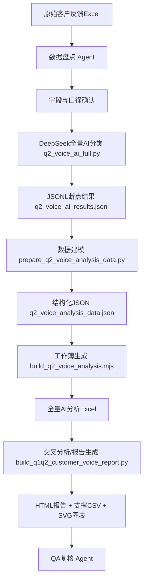

# 客户声音AI分析可复用流程说明

> 适用范围：猛士汽车客户反馈、投诉、咨询、建议、表扬、救援、商城、服务请求等全量客户声音分析。  
> 当前落地样例：2026年Q1、Q2客户声音全量AI梳理、管控分级、交叉分析与HTML报告生成。  
> 重要原则：本文只记录工具链、Agent分工、Skill打包和复用流程，不记录任何明文 API Key。

## 一、这套流程解决什么问题

本流程把“客户咨询/客户反馈清单”从原始 Excel 变成可管理的数据资产，核心目标包括：

1. 全量识别客户声音类型：投诉、咨询、建议、表扬、救援、商城、服务请求、无效/内部进线等。
2. 按业务管理口径分类：交付、服务、售后、品质，以及被剔除的纯销售和其他观察项。
3. 逐条生成结构化 AI 字段：摘要、核心诉求、风险标签、责任建议、管控动作。
4. 形成管控分级：风险等级、是否管控、红黄管控、综合风险分。
5. 自动输出管理报表：全量分析 Excel、支撑 CSV、图表、Markdown/HTML 报告。
6. 将整个过程沉淀为可复跑、可替换模型、可扩展季度/月度的标准流程。

## 二、本次实际使用的 Agent

| Agent | 角色 | 本次任务 | 产出 | 可复用价值 |
| --- | --- | --- | --- | --- |
| Lagrange | Q1数据盘点 Agent | 只读盘点一季度 KPI 目录，确认 Q1 是否存在与 Q2 同口径的全量客户声音数据。 | 判断 Q1 目录有投诉周报、投诉AI摘要、巡检支撑表，但没有与 Q2 完全一致的全量客户声音口径；建议从 `二季度客户声音_全量AI梳理与管控分析.xlsx` 的 `AI明细` 中按 2026-01 至 2026-03 过滤作为 Q1 主口径。 | 适合复用为“历史数据盘点/口径一致性审计 Agent”。 |
| Herschel | 交叉分析设计 Agent | 设计 Q1/Q2 客户声音报告结构、交叉分析维度、图表和支撑表方案。 | 建议生成 `quarter`、`report_topic`、`is_in_scope` 三个核心字段，并按章节拆分 KPI 总览、声音类型、四大专题、渠道、车型、门店、风险管控、正向案例。 | 适合复用为“报告蓝图/指标体系 Agent”。 |
| 主 Agent | 编排与落地 Agent | 读取工具、整合脚本、运行分析、生成 Excel/HTML/Markdown、校验图表和数据文件。 | 生成全量分析工作簿、Q1/Q2综合报告、内嵌图表HTML、支撑表和本文档。 | 适合复用为“端到端执行 Agent”。 |

### 建议后续固定的 Agent 编队

| Agent名称 | 输入 | 输出 | 典型触发场景 |
| --- | --- | --- | --- |
| 数据盘点 Agent | 原始 Excel、历史目录、上期产物 | sheet 清单、字段清单、数据量、时间范围、缺口说明 | 新季度/新月份开始前 |
| 口径设计 Agent | 管理关注点、历史报告、字段清单 | 分类口径、剔除规则、风险分级标准、维度映射 | 报告口径变化、管理层关注点变化 |
| AI分类执行 Agent | 原始清单、模型配置、prompt/schema | JSONL 逐条AI结果、异常行清单、断点续跑状态 | 全量 AI 分析 |
| 数据建模 Agent | 原始清单 + AI结果 | 统一明细、管控分、宽表、汇总表 | 生成分析工作簿前 |
| 交叉分析 Agent | 统一明细 | 透视表、风险矩阵、Top场景、门店/车型/渠道交叉 | 报告写作前 |
| 报告生成 Agent | 支撑表、图表、管理口径 | HTML/Markdown/PDF 可读报告 | 交付管理层 |
| QA复核 Agent | 所有产物 | 行数校验、图片引用校验、字段完整性、口径漂移提示 | 对外交付前 |

## 三、本次涉及和建议打包的 Skills

### 1. 已实际使用的 Skill/能力包

| Skill/能力 | 本次用途 | 复用方式 |
| --- | --- | --- |
| `spreadsheets` | 处理 `.xlsx`，读取 sheet、生成工作簿、输出支撑表、构建 Excel 分析产物。 | 所有客户声音 Excel 分析都应默认使用。 |
| 多 Agent 编排能力 | 并行拆分 Q1 数据盘点、交叉分析设计。 | 用于大文件、大报告、跨目录口径审计。 |
| 本地 Python 数据分析能力 | openpyxl/pandas 读取、清洗、透视、分级、导出 CSV/HTML。 | 作为全流程底座。 |
| 本地 Node artifact-tool 能力 | 生成格式化分析工作簿 `二季度客户声音_全量AI梳理与管控分析.xlsx`。 | 适合复用为标准 Excel 输出层。 |

### 2. 已引用的历史/参考 Skill

| Skill/工具 | 来源 | 本次引用方式 | 可复用点 |
| --- | --- | --- | --- |
| `complaint-weekly-merge` / 一季度投诉分析工具 | 一季度巡检报告工具链 | 作为 Q1 周报合并、投诉AI摘要、巡检匹配的参考口径。 | 适合处理按周分散的投诉周报；可继续作为“投诉专项上游底座”。 |
| `complaint_agent_q1_reference.py` | `02_工具与配置/投诉分析工具_DeepSeek分支` | 保留一季度投诉合并、门店匹配、巡检匹配、AI摘要字段设计。 | 可抽象成“投诉周报合并 Skill”。 |

### 3. 建议沉淀为长期可复用的 Skills

| 建议Skill名称 | 功能边界 | 复用等级 | 原型脚本 |
| --- | --- | --- | --- |
| `customer-voice-ai-classify` | 调用 DeepSeek 对客户声音逐条分类、摘要、风险标签、管控建议，输出 JSONL。 | 高 | `q2_voice_ai_full.py` |
| `complaint-after-sales-extract` | 只针对投诉清单，提取售后重点投诉，输出售后重点 sheet 和摘要统计。 | 高 | `q2_feedback_deepseek.py` |
| `customer-voice-data-model` | 合并原始清单与AI结果，生成统一明细、风险分、管控等级、维度字段。 | 高 | `prepare_q2_voice_analysis_data.py` |
| `customer-voice-workbook-build` | 从结构化 JSON 生成管理分析 Excel，包含总览、AI明细、风险清单、交叉矩阵。 | 高 | `build_q2_voice_analysis.mjs` |
| `customer-voice-report-build` | 基于统一工作簿生成 Q1/Q2 或月度报告、图表、HTML。 | 高 | `build_q1q2_customer_voice_report.py` |
| `customer-voice-qa` | 校验行数、月份范围、图表引用、表格数量、HTML内嵌图、字段完整性。 | 中高 | 当前手工校验命令，可脚本化 |
| `customer-voice-q1-reference-audit` | 判断历史目录是否能与当前全量口径对齐，并输出缺口。 | 中 | Lagrange Agent 任务模式 |

## 四、DeepSeek分析工具链

当前 DeepSeek 分支目录：

`02_工具与配置/投诉分析工具_DeepSeek分支`

### 1. 投诉专项工具：`q2_feedback_deepseek.py`

用途：处理 `猛士客户反馈报表.xlsx` 的 `投诉清单`，逐条调用 DeepSeek，追加 AI 字段，并提取售后重点投诉。

核心输出：

| 输出 | 说明 |
| --- | --- |
| `二季度客户反馈投诉_AI分析_售后重点.xlsx` | 投诉专项分析结果。 |
| `投诉清单` sheet | 原始投诉行 + AI分析字段。 |
| `售后重点投诉` sheet | 提取售后、维修、响应、配件、保险、回访、救援等服务运营重点投诉。 |
| `摘要统计` sheet | 投诉总数、AI完成数、售后重点数量和分类分布。 |

推荐命令模板：

```bash
DEEPSEEK_API_KEY="从环境变量或.env读取，不在文档中明文保存" \
"/Users/i/.cache/codex-runtimes/codex-primary-runtime/dependencies/python/bin/python3" \
"02_工具与配置/投诉分析工具_DeepSeek分支/q2_feedback_deepseek.py" \
  --input-xlsx "猛士客户反馈报表.xlsx" \
  --output-xlsx "二季度客户反馈投诉_AI分析_售后重点.xlsx" \
  --model deepseek-v4-pro \
  --batch-size 2 \
  --workers 60
```

断点规则：

- 默认跳过已有 `AI重点摘要` 的行。
- 中途中断后重跑同一命令即可继续。
- `--force`：重新分析已有 AI 摘要的行。
- `--force-copy`：先从原始文件重新复制输出。

### 2. 全量客户声音工具：`q2_voice_ai_full.py`

用途：处理 `猛士客户反馈报表.xlsx` 的 `清单` sheet，对全量客户声音进行 AI 分类和管控字段生成。

核心输出：

| 输出 | 说明 |
| --- | --- |
| `q2_voice_ai_results.jsonl` | 逐条 AI 分类结果，支持断点续跑。 |
| `q2_voice_ai_results_sample.jsonl` | 小样本或调试参考。 |

AI字段：

| 字段 | 含义 |
| --- | --- |
| `row_id` | 原始清单行ID。 |
| `voice_type` | 客户声音类型，如投诉、咨询、建议、表扬、救援等。 |
| `business_domain` | 业务域，如售后服务、产品质量、车机软件/APP、客服中心等。 |
| `scenario` | 具体场景。 |
| `risk_level` | A/B/C/D 风险等级。 |
| `sentiment` | 情绪倾向。 |
| `control_needed` | 是否需要管理动作。 |
| `value_type` | 风险、机会、正向案例、销售改善等价值类型。 |
| `summary` | 重点摘要。 |
| `core_request` | 客户核心诉求。 |
| `risk_tags` | 风险/机会标签。 |
| `owner_suggestion` | 建议归口。 |
| `control_action` | 建议管控动作。 |
| `basis` | 判定依据。 |

推荐命令模板：

```bash
"/Users/i/.cache/codex-runtimes/codex-primary-runtime/dependencies/python/bin/python3" \
"02_工具与配置/投诉分析工具_DeepSeek分支/q2_voice_ai_full.py" \
  --input-xlsx "猛士客户反馈报表.xlsx" \
  --result-jsonl "02_工具与配置/投诉分析工具_DeepSeek分支/q2_voice_ai_results.jsonl" \
  --env-file "02_工具与配置/投诉分析工具_DeepSeek分支/.env" \
  --model deepseek-v4-pro \
  --batch-size 8 \
  --workers 80 \
  --timeout 180 \
  --max-retries 3
```

并发建议：

- DeepSeek `deepseek-v4-pro` 官方并发上限为账户级 500。
- 当前脚本默认 `--workers 80`、`--batch-size 8`，属于相对稳健配置。
- 如果需要加速，可提高 `--workers`，但要保留失败重试和断点续跑。
- 高并发时优先控制“并发请求数”，不要盲目增大单请求 batch，避免模型输出 JSON 不完整。

## 五、全量客户声音的标准复用流程



### Step 0：准备配置

建议在工具目录放 `.env`，只保存运行环境变量，不在报告或说明文档中暴露真实 Key。

```env
DEEPSEEK_API_KEY=...
DEEPSEEK_BASE_URL=https://api.deepseek.com
DEEPSEEK_MODEL=deepseek-v4-pro
```

如果使用阿里云百炼兼容 OpenAI 接口作为其他 Agent/Skills 的模型，也建议独立命名，避免和 DeepSeek 混用：

```env
BAILIAN_BASE_URL=...
BAILIAN_API_KEY=...
BAILIAN_MODEL=glm-5.2
```

### Step 1：数据盘点

检查内容：

| 检查项 | 目的 |
| --- | --- |
| workbook sheet 名称 | 判断使用 `清单`、`投诉清单` 还是其他 sheet。 |
| 时间范围 | 明确 Q1/Q2/月度边界。 |
| 行数 | 为后续断点和完成率校验提供基准。 |
| 核心字段 | 确认是否有时间、进线类型、工单分类、门店、车型、二/三/四级分类。 |
| 历史目录 | 判断是否能和本期同口径比较。 |

本次结论：Q1/Q2主报告统一采用 `二季度客户声音_全量AI梳理与管控分析.xlsx` 的 `AI明细` 做同源比较，避免 Q1 历史周报和 Q2 全量清单口径不一致。

### Step 2：全量AI分类

运行 `q2_voice_ai_full.py`，输出 JSONL。该步骤是整个流程最关键的“语义结构化”环节。

质量要求：

- 每条记录必须保留 `row_id`，用于回连原始 Excel。
- JSONL 必须可追加，便于断点续跑。
- 明显无效/内部进线可以规则分类，减少模型成本。
- 模型输出必须包含风险、摘要、诉求、标签、建议动作。

### Step 3：数据建模

运行：

```bash
"/Users/i/.cache/codex-runtimes/codex-primary-runtime/dependencies/python/bin/python3" \
"02_工具与配置/投诉分析工具_DeepSeek分支/prepare_q2_voice_analysis_data.py"
```

产出：

`02_工具与配置/投诉分析工具_DeepSeek分支/q2_voice_analysis_data.json`

建模动作：

| 动作 | 说明 |
| --- | --- |
| 原始清单 + AI JSONL 合并 | 形成全量逐条明细。 |
| 月份/季度识别 | 支持 Q1/Q2、月度趋势。 |
| 风险分计算 | 结合风险等级、是否管控、情绪、投诉/救援、外发投诉、派单状态。 |
| 管控等级生成 | 形成红色管控、黄色跟进、蓝色观察、记录留存。 |
| 车型/门店/渠道标准化 | 支持多维交叉分析。 |

### Step 4：生成全量分析工作簿

运行：

```bash
"/Users/i/.cache/codex-runtimes/codex-primary-runtime/dependencies/node/bin/node" \
"02_工具与配置/投诉分析工具_DeepSeek分支/build_q2_voice_analysis.mjs"
```

产出：

`二季度客户声音_全量AI梳理与管控分析.xlsx`

该工作簿是后续报告的主数据资产，推荐长期保留。

关键 sheet：

| Sheet | 用途 |
| --- | --- |
| `管理总览` | 高层概览和核心指标。 |
| `AI明细` | 全量客户声音逐条明细，最重要。 |
| `风险管控清单` | 进入管控的重点记录。 |
| `业务域分析` | 业务域维度的规模与风险。 |
| `车型业务域交叉` | 车型 × 业务域矩阵。 |
| `渠道分析` | 进线渠道差异。 |
| `正向表扬案例` | 正向案例沉淀。 |

### Step 5：生成综合报告

运行：

```bash
"/Users/i/.cache/codex-runtimes/codex-primary-runtime/dependencies/python/bin/python3" \
"02_工具与配置/投诉分析工具_DeepSeek分支/build_q1q2_customer_voice_report.py"
```

产出：

| 文件/目录 | 说明 |
| --- | --- |
| `猛士汽车2026年Q1、Q2客户声音综合报告.html` | 推荐交付版本，图表内嵌，预览稳定。 |
| `猛士汽车2026年Q1、Q2客户声音综合报告.md` | Markdown 版本，便于二次编辑。 |
| `猛士汽车2026年Q1_Q2客户声音综合报告_附件/charts` | SVG 图表源文件。 |
| `猛士汽车2026年Q1_Q2客户声音综合报告_附件/tables` | 支撑 CSV 表。 |

报告生成逻辑：

- 从 `AI明细` 读取 2026-01 至 2026-06。
- 生成 `季度`、`报告维度`、`是否进入主报告`。
- 剔除纯销售、无效/内部进线、其他观察项。
- 聚焦交付、服务、售后、品质。
- 输出 Q1/Q2 总览、交付服务部视角总结、红黄管控、月度趋势、月度四维红黄管控趋势、风险热力图、场景 Top、车型/渠道/门店交叉、正向案例。
- 报告必须包含“数据解读层”，不能只堆图表。当前标准做法是在执行摘要后增加 `交付服务部视角的Q1/Q2总结`，把数据翻译成部门可执行的优势、短板/压力、后续注意事项。

## 六、可复用的数据口径

### 1. 客户声音类型

| 类型 | 管理含义 |
| --- | --- |
| 投诉 | 客户明确表达不满或要求处理，通常应优先关注。 |
| 咨询 | 客户寻求信息或政策解释，可用于识别知识库和服务触点问题。 |
| 建议 | 客户提出产品、服务、流程优化意见。 |
| 表扬 | 正向案例，可沉淀服务标准和优秀实践。 |
| 紧急救援 | 具有时效性和安全感知风险，应单独监测。 |
| 无效/内部进线 | 统计保留，但不进入主报告结论。 |

### 2. 四大报告维度

| 报告维度 | 纳入口径 |
| --- | --- |
| 交付 | 交付流程、提车、上牌、PDI、充电桩/家充、交车后初期权益兑现。 |
| 服务 | 客服中心、响应、回访、沟通、服务群、商城服务、权益/活动解释中的非销售服务问题。 |
| 售后 | 维修、保养、配件、质保、保险协同、门店售后接待、工单闭环。 |
| 品质 | 车辆故障、产品质量、车机/APP/OTA、智驾、设计缺陷、功能体验。 |

剔除原则：

- 纯销售政策、试驾、价格优惠、购车权益活动等不进入主结论。
- 如果销售问题已经转化为交付履约或交付后权益兑现，则纳入交付。

### 3. 管控分级

| 名词 | 含义 | 用途 |
| --- | --- | --- |
| 风险等级 | AI 对客户声音严重程度的判断，分为 A/B/C/D。 | 判断问题严重程度。 |
| A重大管控 | 安全质量、强烈不满、外诉/媒体/监管风险、反复未解决等。 | 优先进入红色闭环。 |
| B重点跟进 | 明显负向情绪、服务失效、升级苗头。 | 进入黄色跟进或重点工单。 |
| C一般关注 | 诉求明确但风险尚未放大。 | 常规跟进和趋势观察。 |
| D记录观察 | 风险较低或信息价值为主。 | 留痕和知识库优化。 |
| 是否管控 | 是否需要明确管理动作。 | 决定是否进入闭环台账。 |
| 管控等级 | 红色管控、黄色跟进、蓝色观察、记录留存。 | 决定处理时限和升级层级。 |
| 综合风险分 | 量化排序字段。 | 用于红黄管控 Top 排序。 |

### 4. 交付服务部视角总结模板

这部分是报告的管理解读层，适合放在执行摘要之后、详细图表之前。它解决的问题是：把交付、服务、售后、品质四个维度的数据变化，转成部门负责人能直接使用的判断。

标准输出结构：

| 输出项 | 说明 | 数据来源 |
| --- | --- | --- |
| 整体判断 | 判断 Q2 相比 Q1 是整体改善、整体承压，还是结构性分化。 | 四维度季度总览、红黄管控量、月度趋势。 |
| 优势 | 说明哪些维度在 Q2 有改善或保持稳定。 | 声音量变化、红黄管控变化、红黄占比变化。 |
| 短板/压力 | 说明哪些维度风险集中、增长明显或高风险密度上升。 | 红黄管控、风险等级、Top场景、门店/对象风险。 |
| 后续注意 | 转化为下一季度管理动作，不停留在数据描述。 | 高频场景、核心诉求、control_action、门店/渠道/车型交叉。 |

当前 Q1/Q2 报告采用的标准表头：

| 维度 | Q1声音量 | Q2声音量 | 声音量变化 | Q1红黄 | Q2红黄 | 红黄变化 | Q2红黄占比 | 优势 | 短板/压力 | 后续注意 |
| --- | --- | --- | --- | --- | --- | --- | --- | --- | --- | --- |

四个维度的解读口径：

| 维度 | 解读重点 | 典型管理动作 |
| --- | --- | --- |
| 交付 | 看交付量变化是否带来红黄风险同步放大，重点关注提车、上牌、PDI、家充、权益兑现和交付后初期体验。 | 建立交付后 7-30 天回访清单，提前处理家充、上牌、随车物料、权益兑现问题。 |
| 服务 | 看客服、商城、活动权益解释、普通咨询和无效进线是否下降，重点识别重复咨询。 | 建设 FAQ、商城商品知识库、前置告知和坐席标准话术。 |
| 售后 | 看维修、保养、质保、配件、保险、救援、工单闭环是否成为增长压力。 | 对维修后复发、救援超时、费用报销、门店沟通冲突、重复投诉建立区域闭环。 |
| 品质 | 看总量和红黄占比是否背离，识别高风险密度是否上升。 | 建立服务端发现、技术端复核、质量/研发回流、客户阶段反馈的闭环机制。 |

复用要求：

- 每次生成季度/月度报告时，都应保留该总结层。
- 总结不能只写“增加/减少”，必须解释为什么对交付服务部重要。
- 如果某维度总量下降但红黄占比上升，应明确提示“风险密度上升”。
- 如果某维度总量上升但红黄不变或占比下降，应区分“规模扩大”与“风险放大”。
- 结尾必须给出下一阶段管理重点，例如从“接住进线”转向“缩短闭环链路”。

### 5. 月度红黄管控趋势

这部分是管控复盘必须保留的图表，不应只看季度汇总。标准输出包括：

| 输出 | 说明 |
| --- | --- |
| `2026年1-6月四大维度红黄管控趋势` | 折线图，按月份展示交付、服务、售后、品质四个维度的红黄管控量。 |
| `月度四维红黄管控趋势.csv` | 支撑表，字段为 `月份、交付、服务、售后、品质`。 |

当前 Q1/Q2 报告新增后的典型判断：

- Q2 服务红黄管控在 5-6 月明显下降。
- Q2 售后红黄管控在 5 月、6 月抬高，是后续管控主压力。
- 交付季度红黄总量 Q1/Q2 均为 224 条，但红色管控 Q2 增加、黄色跟进 Q2 下降，说明总量相同背后仍需看风险结构。

复用要求：

- 总量趋势和红黄趋势必须同时看。
- 如果某月客户声音总量下降但红黄管控上升，应提示风险密度上升。
- 如果某月客户声音总量上升但红黄管控不升，应提示更多是规模或咨询量扩大。

## 七、高度可复用资产清单

| 资产 | 当前路径 | 复用等级 | 说明 |
| --- | --- | --- | --- |
| DeepSeek投诉专项工具 | `02_工具与配置/投诉分析工具_DeepSeek分支/q2_feedback_deepseek.py` | 高 | 任意季度投诉清单可复用，只需调整输入输出。 |
| DeepSeek全量分类工具 | `02_工具与配置/投诉分析工具_DeepSeek分支/q2_voice_ai_full.py` | 高 | 全量客户声音语义结构化核心工具。 |
| JSONL断点结果 | `02_工具与配置/投诉分析工具_DeepSeek分支/q2_voice_ai_results.jsonl` | 高 | 可审计、可断点、可重建工作簿。 |
| 数据建模脚本 | `02_工具与配置/投诉分析工具_DeepSeek分支/prepare_q2_voice_analysis_data.py` | 高 | 统一字段、风险分、管控等级、交叉维度。 |
| 工作簿生成脚本 | `02_工具与配置/投诉分析工具_DeepSeek分支/build_q2_voice_analysis.mjs` | 高 | 标准 Excel 输出层。 |
| Q1/Q2报告脚本 | `02_工具与配置/投诉分析工具_DeepSeek分支/build_q1q2_customer_voice_report.py` | 高 | 可扩展为月报、季报、半年报。 |
| 一季度投诉参考工具 | `02_工具与配置/投诉分析工具_DeepSeek分支/complaint_agent_q1_reference.py` | 中高 | 周报合并、门店/巡检匹配参考。 |
| HTML综合报告 | `猛士汽车2026年Q1、Q2客户声音综合报告.html` | 高 | 管理层交付版本。 |
| 全量分析工作簿 | `二季度客户声音_全量AI梳理与管控分析.xlsx` | 高 | 后续复盘、透视、二次分析主资产。 |

## 八、建议的复跑清单

每次新月度/季度复跑，按以下顺序执行：

1. 放入新的客户反馈 Excel。
2. 运行数据盘点 Agent，确认 sheet、字段、时间范围、行数。
3. 小样本运行 `q2_voice_ai_full.py --limit 50`，检查 AI 字段质量。
4. 全量运行 `q2_voice_ai_full.py`，生成 JSONL。
5. 运行 `prepare_q2_voice_analysis_data.py`，生成结构化 JSON。
6. 运行 `build_q2_voice_analysis.mjs`，生成分析工作簿。
7. 运行 `build_q1q2_customer_voice_report.py` 或新的月报/季报脚本。
8. 运行 QA：
   - 原始清单行数是否等于 AI 明细行数。
   - 月份范围是否正确。
   - JSONL 是否有重复 row_id。
   - 红黄管控清单是否有摘要和处置动作。
   - HTML 是否内嵌所有图表；当前 Q1/Q2 报告为 11 张图。
   - 支撑表数量和图表数量是否符合预期。

## 九、QA命令模板

```bash
python3 - <<'PY'
from pathlib import Path

root = Path('.')
html = root / '猛士汽车2026年Q1、Q2客户声音综合报告.html'
md = root / '猛士汽车2026年Q1、Q2客户声音综合报告.md'
attach = root / '猛士汽车2026年Q1_Q2客户声音综合报告_附件'

text = html.read_text(encoding='utf-8')
print('html_exists', html.exists(), 'size', html.stat().st_size)
print('md_exists', md.exists(), 'lines', len(md.read_text(encoding='utf-8').splitlines()))
print('embedded_svg', text.count('<svg class="embedded-chart"'))
print('tables', text.count('<table>'))
print('charts', len(list((attach / 'charts').glob('*.svg'))))
print('support_tables', len(list((attach / 'tables').glob('*.csv'))))
print('has_control_section', '管控分级与名词解释' in text)
PY
```

## 十、下一步建议

1. 把 `q2_voice_ai_full.py`、`prepare_q2_voice_analysis_data.py`、`build_q2_voice_analysis.mjs`、`build_q1q2_customer_voice_report.py` 抽成一个正式 `customer-voice-analysis` Skill。
2. 把 prompt、字段 schema、风险分公式、四维度映射规则从脚本中拆到配置文件，便于季度复用时只改配置。
3. 把 QA 命令做成 `qa_customer_voice_outputs.py`，每次交付前自动输出校验报告。
4. 把 Agent 任务模板固化：数据盘点、口径设计、交叉分析、报告QA 四类 Agent 可以长期复用。
5. DeepSeek 负责逐条客户声音语义结构化；阿里云百炼 `glm-5.2` 可以用于 Agent 的分析规划、报告改写、QA 总结等非逐条高并发任务。
